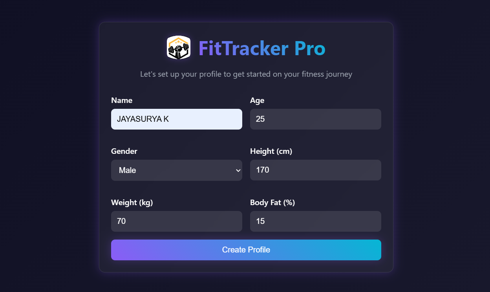
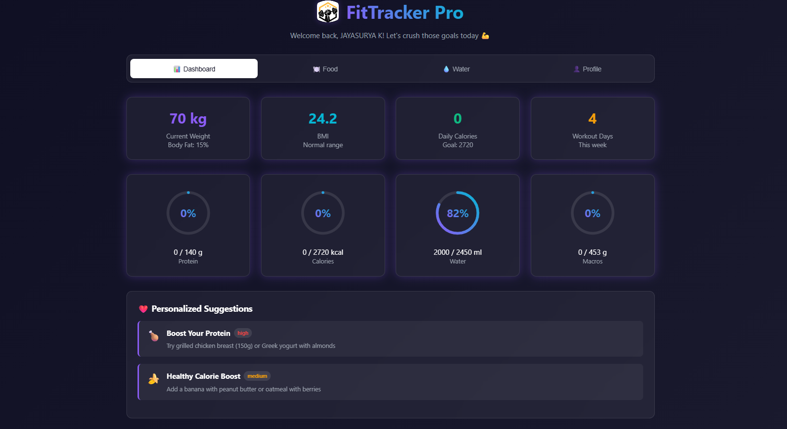
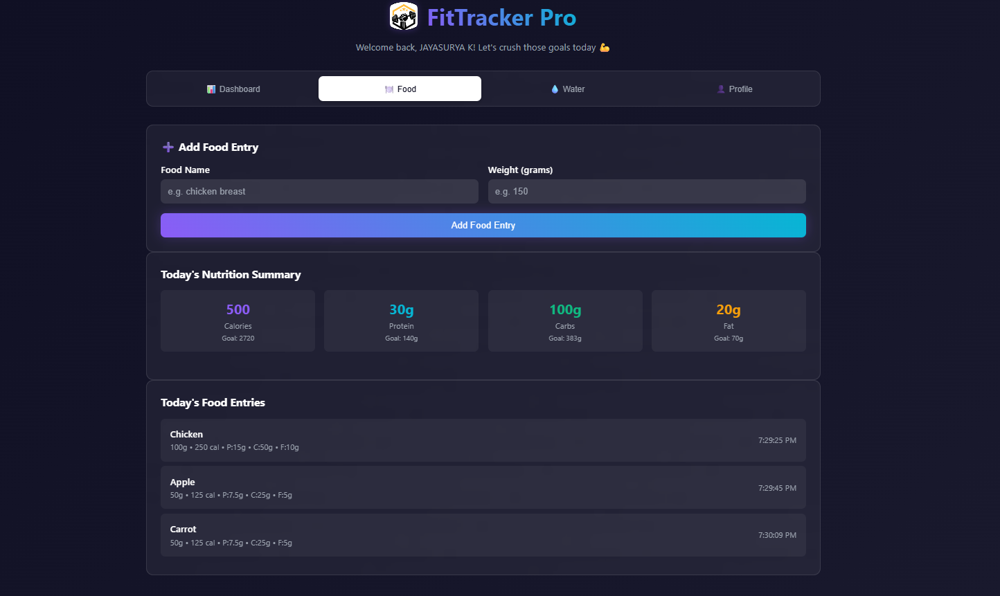
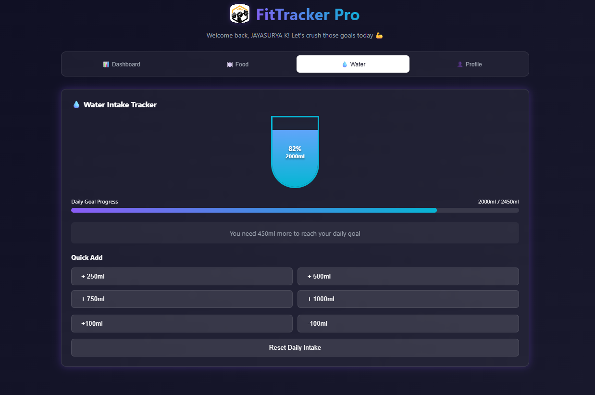
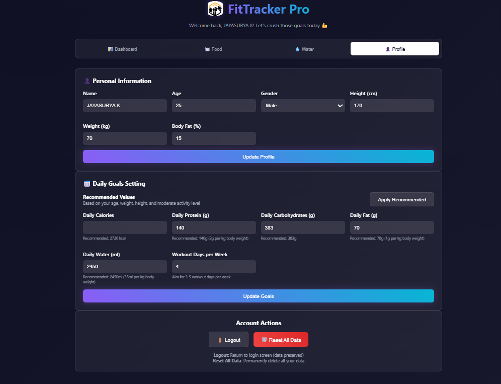

**FitTracker Pro**
FitTracker Pro is a modern, responsive fitness tracking web application for gym-goers. 
It allows users to track food, water intake, set fitness goals, and monitor progress daily — all within a clean, animated UI.

---

**Features**
- 📝 User profile setup (name, age, height, weight, etc.)
- 🎯 Daily goals for calories, protein, carbs, fat, and water
- 🍗 Food tracking by grams with macronutrient calculation
- 💧 Water intake tracking with visual indicators
- 📊 Dashboard with real-time daily stats
- 🌈 Dark-themed, glassmorphic UI
- 🔄 LocalStorage-based data persistence (no backend needed)

---

**📸 Screenshots**

LOGIN DETAILS
 

DASHBOARD

FOOD INTAKE ENTRY
 

WATER INTAKE TRACKER

PROFILE PAGE
 | 

---

**🛠 Tech Stack**

- HTML5
- CSS3 (with custom variables + effects)
- JavaScript (Vanilla)
- LocalStorage

---

**🧾 License**

This project is open-source and free to use.
